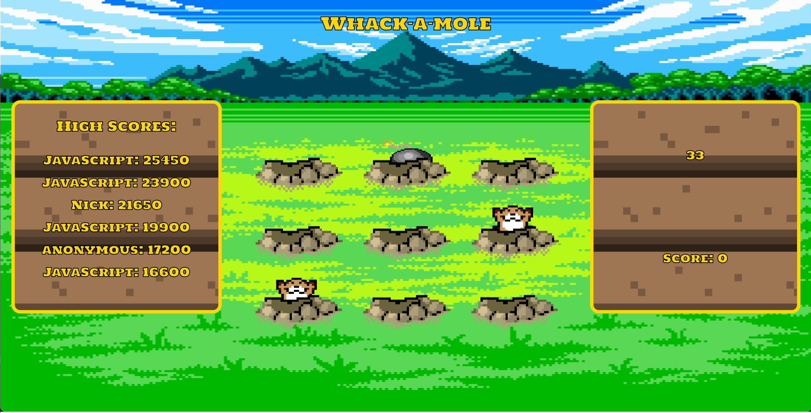

# Whack-a-Mole-MVP
This repository is the minimum viable product of a 24 hour sprint to make a whack-a-mole game web application. The purpose was to create something functional in 24 hours using any technologies desired. The app is complete, but not currently deployed.

## Tech Stack

## Engineer
[Nick Adam](https://github.com/nicholaspix)

